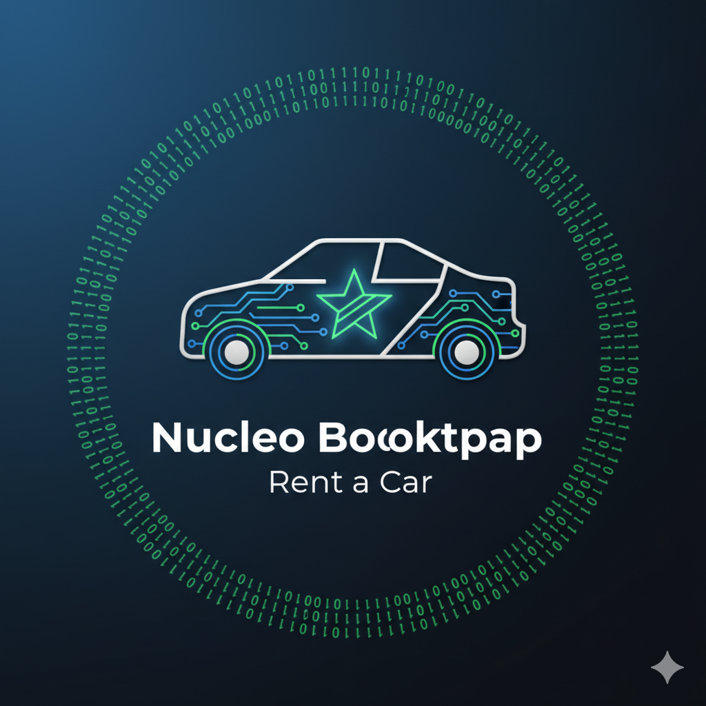

# Stellar Nucleo Bootcamp - Rent a Car



This is a sample project created for the Nucleo Bootcamp, demonstrating a decentralized application (dApp) for renting cars, built on the Stellar blockchain.

## Smart Contract

The smart contract is located in the `contracts/rent-a-car` directory. It is written in Rust and uses the Soroban smart contract framework.

### Functionality

The smart contract allows:

- **Car Owners:** to list their cars for rent, set a price per day, and receive payments.
- **Renters:** to rent available cars, pay for the rental, and return the car.
- **Admin:** to set a fee for the service and withdraw the collected fees.

## Frontend

The frontend is a React application located in the `src` directory. It provides a user interface to interact with the smart contract.

### Features

- Connect to a Stellar wallet (Freighter).
- View a list of available cars.
- Rent a car.
- Return a car.
- For car owners, add and remove cars from the listing.
- For the admin, set the admin fee and withdraw the collected fees.

## How to Run

### Prerequisites

- [Node.js](https://nodejs.org/) (v18 or higher)
- [pnpm](https://pnpm.io/)
- [Rust](https://www.rust-lang.org/)
- [Soroban CLI](https://soroban.stellar.org/docs/getting-started/setup)

### Installation

1.  Clone the repository:

    ```bash
    git clone https://github.com/masch/nucleo-bootcamp.git
    cd nucleo-bootcamp
    ```

2.  Install the dependencies:

    ```bash
    pnpm install
    ```

### Running the Frontend

1.  Start the development server:

    ```bash
    make run
    ```

2.  Open your browser and navigate to `http://localhost:5173`.

### Building and Deploying the Smart Contract

1.  Build and deploy the smart contract to the Stellar network (Futurenet):

    ```bash
    make contract-build-and-deploy
    ```

2.  Copied Contract id generated to .env file:

    ```readme
    PUBLIC_CONTRACT_ADDRESS=[CONTRAC-ID]
    ```
